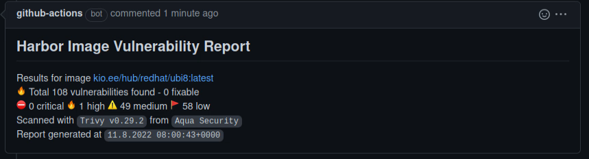

# Harbor Scan Report Action
One of fantastic options of [Harbor](https://goharbor.io/) is integrations with different vulnerability scanners. 
They provide list of vulnerabilities found in image. 

This action gets this scan report and makes comment with scan results for given docker image.

Currently, it can comment Pull Requests (PR) and issues.

This action consists from 2 parts:
1. Getting scan report
2. Generating GitHub comment (optional)

## Why it might be useful?

* Your image is stored at [Harbor](https://goharbor.io/)
* Your might want to prevent unsecure images from been deployed

## Examples
* Clean image

* Vulnerable image


## Configuration
* Minimal valid example
```yaml
- name: Run Report
        uses: kyberorg/harbor-scan-report@v0.1
        with:
          harbor-host: my_harbor.tld
          image: my_harbor.tld/hub/redhat/ubi8:latest
```
* Full example
```yaml
- name: Run Report
        uses: kyberorg/harbor-scan-report@v0.1
        with:
          harbor-host: my_harbor.tld
          harbor-proto: http
          harbor-port: 8080
          harbor-robot: ${{ secrets.HARBOR_ROBOT }}
          harbor-token: ${{ secrets.HARBOR_TOKEN }}
          image: my_harbor.tld:8080/hub/redhat/ubi8:latest
          digest: sha256:01814f4b10f321f09244a919d34b0d5706d95624b4c69d75866bb9935a89582d
          timeout: 150
          check-interval: 10
          max-allowed-severity: high
          github-url: ${{ github.event.pull_request.comments_url }}
          github-token: ${{ secrets.GITHUB_TOKEN }}
```

## Inputs
### `harbor-host`
String with hostname, without protocol and port.

Required: `yes`

### `image`
Image to scan. Format: `registry.tld/project/repo:tag[@sha256:digest]` or `project/repo:tag[@sha256:digest]`. 

Tag is optional, if tag missing default tag `latest` will be used.  

Digest is also optional. You can set it using [digest input](#digest)

Required: `yes`

### `digest`

You can specify image digest, that you expect. This is useful for rolling tags.

Action will wait until image has given digest.

Format: `sha256:01814f4b10f321f09244a919d34b0d5706d95624b4c69d75866bb9935a89582d`

Required: `no`

### `harbor-robot`
Robot or Username to access Harbor with. Robot with limited privileges is preferred.

This parameter is optional, but without credentials action can access public repositories only. 

Required: `no`

### `harbor-token`
Token for Robot or password of User,  defined in `harbor-robot`.

This parameter is optional, but without credentials action can access public repositories only.

Required: `no`

### `max-allowed-severity`
Minimum Vulnerability severity after which action considered as failed. 

Valid values: `none`, `low`, `medium`, `high`, `critical`

Default value: `critical`

* `none` means zero-tolerance to any vulnerabilities i.e. action succeeds only if image hasn't any vulnerabilities.

* `critical` means that action never fails, even if image has critical vulnerabilities.

### `report-sort-by`
Sorting criteria for Vulnerability Report. 

Valid Values: `severity`, `score`

Default value: `severity`

* `severity` means that report will be sorted by Harbor's Severity
* `score` means that report will be sorted by CVSSv3 Score

### `github-url`
GitHub API endpoint to use. Normally, you would use built-in var `github.event.issue.comments_url` for commenting issues
or `github.event.pull_request.comments_url` - for commenting pull requests.

If nothing defined - commenting mode is disabled.

Required: `no`
```yaml
github-url: ${{ github.event.pull_request.comments_url }}
```

### `github-token`
A GitHub personal access token used to comment on your behalf. 
Normally, it can is appended to action's secrets as `${{ secrets.GITHUB_TOKEN }}`
```yaml
github-token: ${{ secrets.GITHUB_TOKEN }}
```

### `comment-title`
String that is used as comment title.

Default: `Docker Image Vulnerability Report`

### `comment-mode`
What shall be done on subsequent runs. Action can create new comment or update existing one. 

Valid values: `create_new` and `update_last`

Default value: `create_new`

### `timeout`
Time in seconds, after which action fails. 

First, action waits for image been present in Harbor, second it waits for scan report been ready.

Should positive integer with number of seconds.

Default: `120` (2 minutes)

### `check-interval`
Time in seconds between doing requests to Harbor. Valid for waiting for image appears in Harbor and waiting for scan report.

Should positive integer with number of seconds.

Default: `5` (5 seconds)

### `harbor-proto`
Protocol of Harbor instance. Use it, if your Harbor instance can be accessed only by using `http`.

Valid values: `http` and `https`.

Default value is `https`. 

### `harbor-port`
Custom port of Harbor instance. Use it, if Harbor instance has custom port.

Any port within `0-65535` range.
